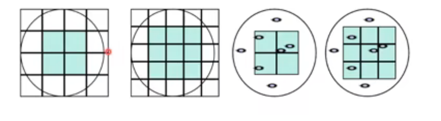

# 第二章 计算机系统结构基础
## 计算机成本
### 价格因素
+ 超级计算机：追求高性能不计成本
+ 嵌入式：牺牲一部分性能，追求低功耗和成本
+ 介于两者之间的其他计算机：追求性价比，包含pc工作站等
### 影响成本的因素
+ R&D投入(research and development)：占总支出比例
+ 生产成本：芯片生产、封装、测试成本
+ Volume(产量)：降低一次性成本，加速学习过程
## 晶元与晶片

$$芯片成本 = \frac{晶片成本+测试成本+封装成本}{最终良品率}$$
+ 封装成本与功耗、引脚数目、材料相关
  
$$晶片成本 = \frac{晶圆成本}{每片晶圆上的晶片数\times晶片成品率}$$
+ 90nm工艺下每个12英寸晶圆成本在3000~6000美元

$$每个晶圆的晶片数 = \frac {π(晶圆直径/2)^2}{晶片的面积}-\frac {π\times晶圆直径}{\sqrt{2\cdot晶片的面积}}$$

$$晶片成品率 = 晶圆成品率\times(1+ \frac{单位面积内缺陷数目\times晶片面积}{α})^{-α}$$
+ α是衡量工艺复杂程度的参数，在目前工艺下约为4
+ 单位面积的缺陷数目与工艺相关，在目前工艺下约为：0.4~0.8 个/$cm^{2}$